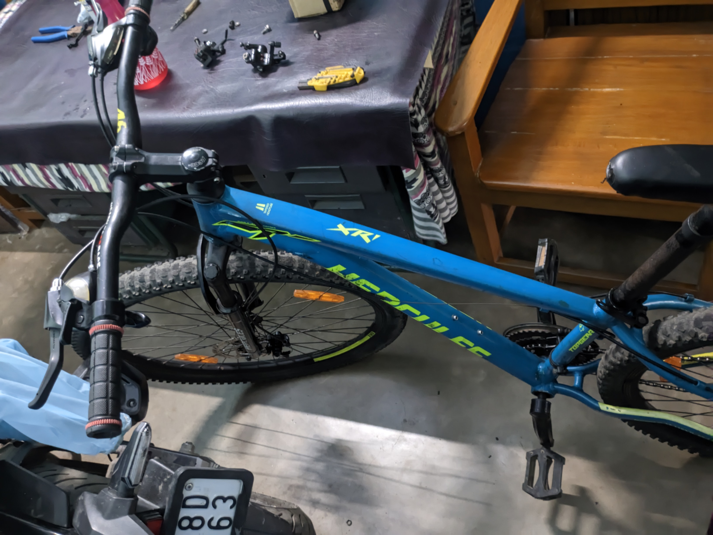
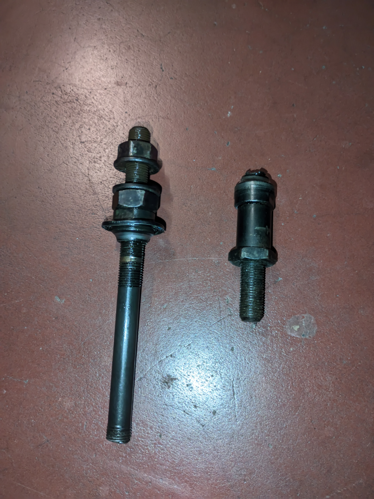
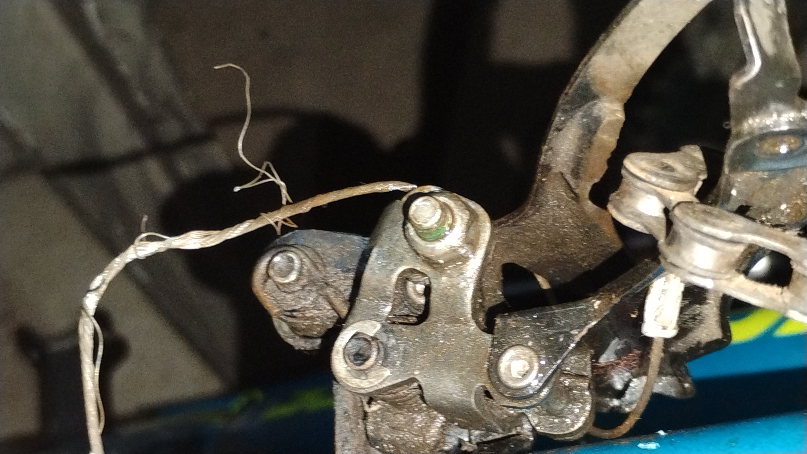
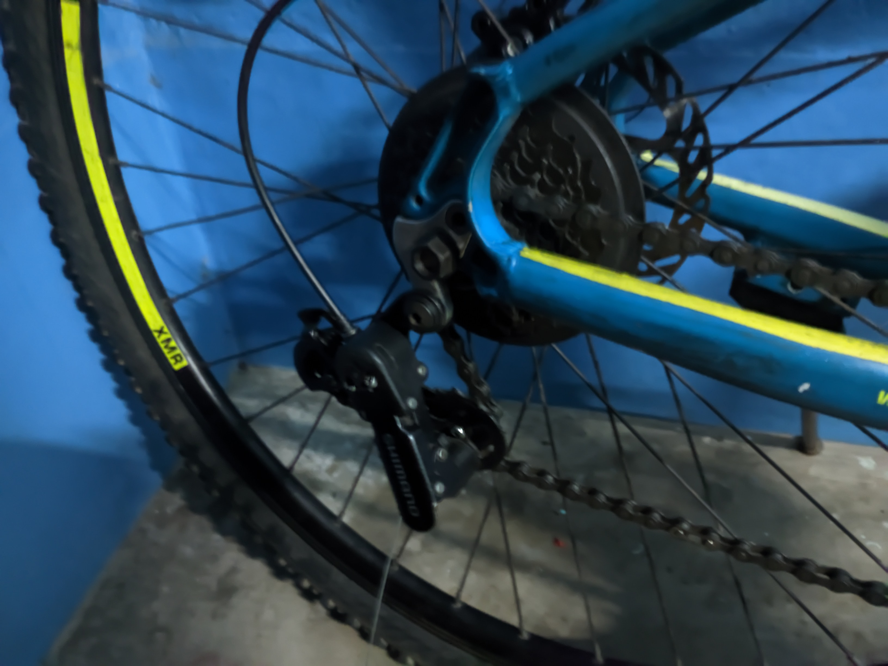
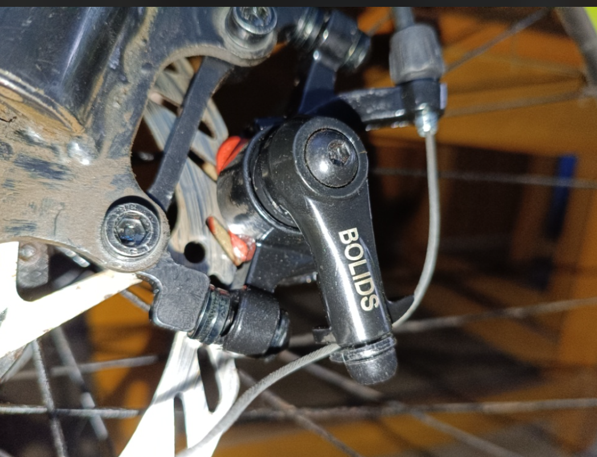
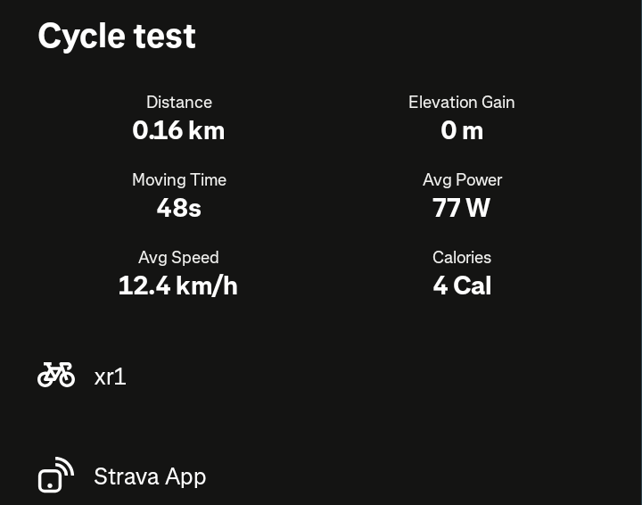

# 🛠️ Hercules MTB Mechanical Rebuild & Restoration

<!-- 📸 UPLOAD HERO IMAGE HERE -->

*> The fully restored Hercules MTB post-test ride.*

## 📋 Executive Summary
This repository serves as the technical record for the mechanical restoration of a Hercules mountain bicycle (21-Speed Shimano Tourney). Initially in a non-functional, degraded state—plagued by a snapped hollow axle, seized wheel bearings, missing disc brake components, and jammed shifter mechanics—the bicycle was systematically diagnosed and rebuilt on a strict budget.

* **Lead Mechanic:** Arghyadip Jana
* **Location:** Mahishadal, West Bengal
* **Final Status:** 100% Operational & Road-Tested
* **Total Project Cost:** ₹5,578.80 (Including base bicycle and new tooling)

---

## 🛑 Initial Diagnostics & System Failure Matrix

| Subsystem | Identified Failure / Fault Condition | Severity | Initial Status |
| :--- | :--- | :---: | :--- |
| **Wheel Axles & Hubs** | Snapped hollow rear axle shaft, seized ball bearings, freewheel body dragging against hub housing, flipped axle nut orientation. | 🔴 Critical | Inoperable |
| **Brake System** | Front caliper completely missing; rear caliper mounted with only 1 bolt; missing caliper return spring; incorrect bracket offset. | 🔴 Critical | No Stopping Power |
| **Front Drivetrain** | Stripped/frozen limit screw on front derailleur; inner shift cable frayed into a bird's-nest knot jammed inside left shifter pod. | 🟠 High | Frozen Cable |
| **Rear Drivetrain** | Bent outer cage plate on rear derailleur pressing against lower pulley wheel; chain derailing off top jockey wheel; unadjusted B-tension. | 🟠 High | Chain Jamming |
| **Chassis & Tires** | Depressurized rear inner tube; missing side stand bolt hardware; un-crimped cable ends causing wire unraveling. | 🟡 Moderate | Flat Tire |

<!-- 📸 UPLOAD BEFORE IMAGES HERE -->

  
  

*> Initial condition: Broken rear axle and jammed front gear cable.*

---

## 🔧 Chronological Restoration Phases

### Phase 1: Axle Reconstruction & Front Wheel Mounting
* **Rear Axle Overhaul:** Replaced the snapped hollow rear axle with a solid 7-inch axle replacement, cleaned and repacked hub bearings, and re-aligned the freewheel spacing to eliminate drag.
* **Flange Nut Correction:** Corrected the inverted installation of the 15mm front axle nuts, ensuring the flat flange face pressed flush against the dropout for even clamping force.

### Phase 2: Rear Derailleur & Cage De-Jamming
* **Cage Realignment:** Identified the outer metal cage plate was bent inward, physically pinching the chain and locking the lower tension pulley wheel.
* **Clearance Optimization:** Bent the guard plate outward to restore full clearance, allowing the chain to glide smoothly over the plastic pulley teeth.

<!-- 📸 UPLOAD DERAILLEUR IMAGE HERE -->

*> Aligning the rear derailleur cage and jockey wheels.*

### Phase 3: Front Shifter Extraction & Cable Overhaul
* **Cable Extraction:** Cut the severely knotted, frayed inner wire using high-leverage shears at a local workshop.
* **Shifter Pod Clearing:** Pushed the inner lead anchor head inward to dislodge it from the internal spool, clearing the housing.
* **Fresh Routing:** Routed a new LORWADIYA inner shift cable through the handlebar pod and clamped it directly inside the stamped channel under the Shimano Tourney TZ anchor nut.

### Phase 4: Brake System Installation & Caliper Optimization
* **Hardware Sourcing:** Procured a universal **CYIDER Mechanical Disc Brake Caliper Set** equipped with return springs and brackets.
* **Adapter Offset Resolution:** Swapped the included `F180/R160` front adapter bracket for the original `F160` bracket to correctly lower the caliper onto the 160mm rotor braking track.
* **Auto-Centering:** Adjusted the inner stationary pad with a 5mm Allen key, used the lever-squeeze trick to self-center the caliper body, and secured both units with dual M6 bolts.

<!-- 📸 UPLOAD BRAKE IMAGE HERE -->

*> The new CYIDER mechanical caliper dialed in on the 160mm rotor.*

### Phase 5: Final Tuning & Cycle Shop Integration
* **Screw Extraction:** Professionally extracted the stubborn front derailleur limit screw.
* **Cleaning & Lubrication:** Degreased the drivetrain using LUBRIZAP Chain Cleaner and applied WD-40 to pivot points for smooth actuation.
* **Jockey Wheel & B-Tension Tuning:** Adjusted the B-tension screw on the rear derailleur to maintain a 5–6mm gap between the top jockey wheel and cassette cogs.

---

## 💰 Bill of Materials (BOM) & Financial Summary

| Item / Component Description | Qty | Source / Procurement | Cost (INR) |
| :--- | :---: | :--- | :--- |
| **Base Bicycle (Hercules MTB)** | 1x | As-is / Pre-owned | ₹4,000.00 |
| CYIDER Mechanical Disc Brake Caliper Set (Front & Rear) | 1 Set | Amazon India | ₹364.00 |
| 7-inch Cycle Rear Hub Axle with Steel Ball Bearings | 1x | Amazon India | ₹230.00 |
| LORWADIYA Cycle Gear Shifter Cable (2pc) | 1 Set | Amazon India | ₹151.25 |
| WD-40 Spray & LUBRIZAP Chain Cleaner Spray | 1 Set | Amazon India | ₹512.55 |
| SPARTAN 6-Pcs Ring Spanner Set (Tooling) | 1 Set | Amazon India | ₹291.00 |
| Front Derailleur Screw Removal & Tire Inflation | 1x | Local Cycle Shop | ₹30.00 |
| **Total Project Investment** | | | **₹5,578.80** |

---

## ✅ Post-Restoration Quality Verification

A comprehensive multi-point inspection was executed to verify mechanical safety:

### Drivetrain & Frame
- [x] Front axle 15mm nuts torqued with flange facing inward.
- [x] Rear axle centered with zero freewheel drag.
- [x] Front derailleur shifts smoothly across all 3 chainrings.
- [x] Rear derailleur indexes crisply across all 7 cogs.
- [x] Drivetrain degreased, lubricated, and B-tension adjusted.

### Brakes & Ergonomics
- [x] Front caliper aligned on F160 bracket; 100% pad bite.
- [x] Rear caliper secured with 2x M6 bolts; wheel locks tight.
- [x] Inner brake pads dialed to 1mm rotor clearance.
- [x] Shift cables replaced and tensioned.
- [x] Tires inflated; side stand secured.

<!-- 📸 UPLOAD STRAVA SCREENSHOT HERE -->

*> Verification: Successful 0.16 km local para road test with flawless gear shifting and braking.*

---
